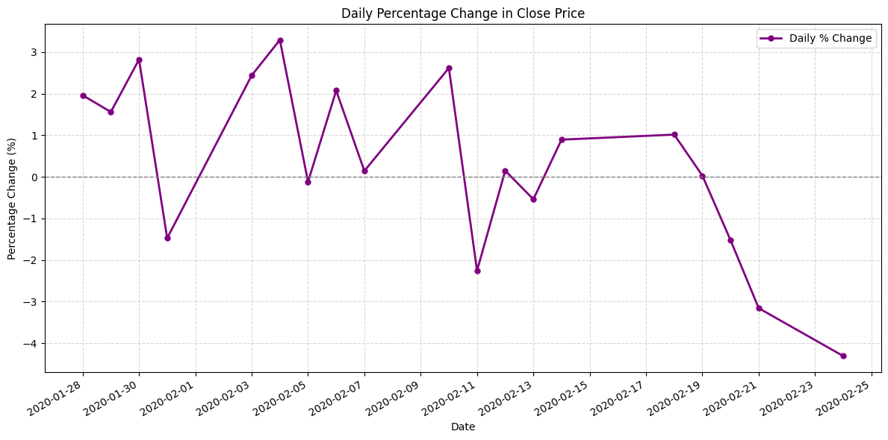
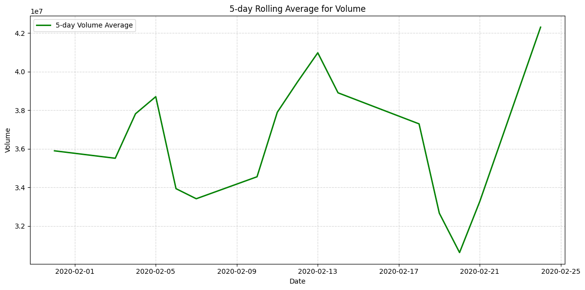

## Xianjing_Huang_Mini_Proj_9
[](https://github.com/nogibjj/Xianjing_Huang_Individual_Project_1/actions/workflows/install.yml)[](https://github.com/nogibjj/Xianjing_Huang_Individual_Project_1/actions/workflows/lint.yml)[](https://github.com/nogibjj/Xianjing_Huang_Individual_Project_1/actions/workflows/format.yml)[](https://github.com/nogibjj/Xianjing_Huang_Individual_Project_1/actions/workflows/test.yml)


### Directory Tree Structure 
```
Xianjing_Huang_Mini_Proj_9/
├── .devcontainer/
│   ├── devcontainer.json
│   └── Dockerfile
├── .github/
│   └── workflows/
│       ├── format.yml
│       ├── install.yml
│       ├── lint.yml
│       └── test.yml
├── imgs/
├── .gitignore
├── 5_day_volume_avg.png
├── lib.py
├── Makefile
├── mini9.ipynb
├── MSFT-stock.csv
├── pct.png
├── README.md
├── report.pdf
├── requirements.txt
├── script.py
├── stock_line_chart.png
├── test_lib.py
└── test_script.py
```
`lib.py`: Read Dataset by Pandas.

`script.py`: generate summary statistics by Pandas, draw chart, generate PDF.

`test_lib.py`: test functions in lib.

`test_script.py`: test functions in script.

`mini9.ipynb`: Set up a cloud-hosted Jupyter Notebook in Google Colab. Save a copy to github. [Colab link included]

`Makefile`: Defines scripts for common project tasks such as install, lint format, test, and 'generate and push report'.

`.github/workflows/xx.yml`: Defines the GitHub Actions workflow for Format, Install, Lint, and Test.

### Colab Link
https://colab.research.google.com/github/Remi12138/Xianjing_Huang_Mini_Proj_9/blob/main/mini9.ipynb

### Requirements
* Set up a cloud-hosted Jupyter Notebook (e.g., Google Colab)
* Perform data manipulation tasks on a sample dataset

### Preparation 
1. Open codespaces 
2. Wait for container to be built and pinned requirements from `requirements.txt` to be installed 
3. If running locally, `git clone` the repository and use `make install`


### Check format and test errors
1. Format code `make format`

2. Lint code `make lint`

3. Test code `make test`


### Descriptive Statistics


### Visualization


### Data Manipulation
I add 2 new columns to dataset:

1. Daily percentage change -- 'Pct_Change'

2. 5-day rolling average for volume -- '5-day Volume Avg'.

New Statistics:


New Visualization:



### Report
Generated summary report (PDF) via CI/CD.
You can find it here [Report](/report.pdf)